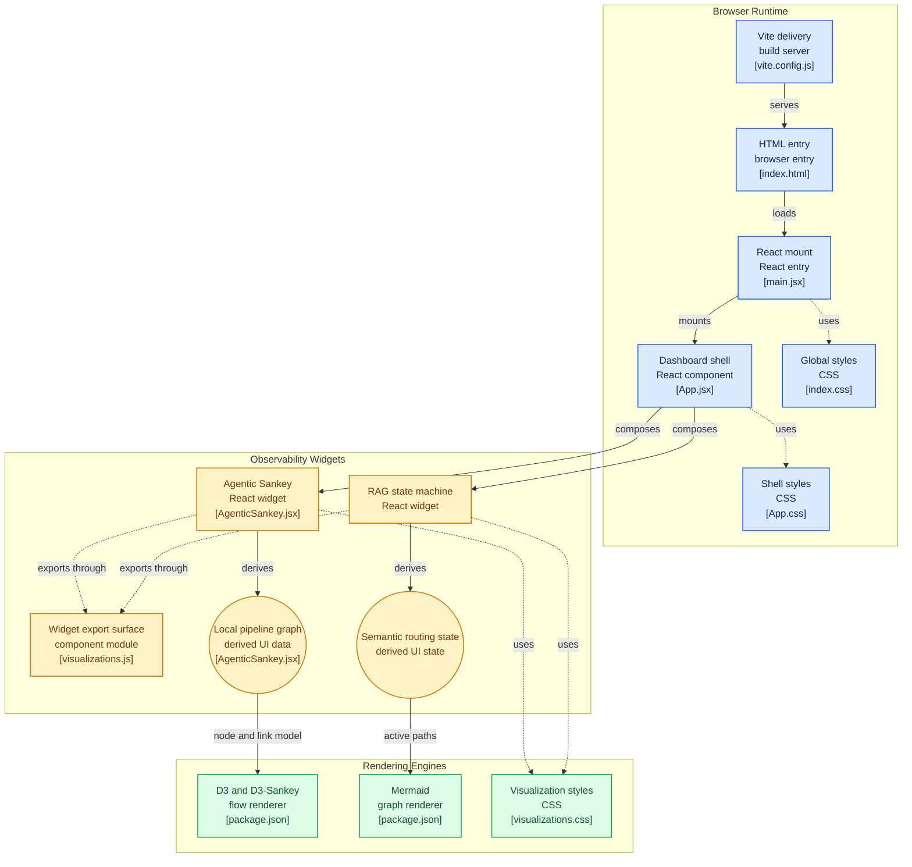

# Vivid Visualization Matrix - Project Architecture

This document provides a comprehensive overview of the architecture of the Vivid Visualization Matrix project, outlining the key components, data flow, and technologies used.

## Architecture Diagram

The following diagram illustrates the high-level architecture and component interactions within the system:

## System Components

The application is structured into three primary sub-systems:

### 1. Browser Runtime
This layer handles the core application delivery, initialization, and layout.
- **Vite:** Acts as the build tool and development server, serving the initial HTML.
- **HTML & React Entry (`index.html`, `main.jsx`):** Bootstraps the React application and mounts it to the DOM.
- **Dashboard Shell (`App.jsx`):** The main container component that orchestrates layout and composes the various visualization widgets.
- **Styling:** Global styles (`index.css`) and shell-specific styles (`App.css`) manage the baseline aesthetic and layout of the application.

### 2. Observability Widgets
These components encapsulate the domain logic for the distinct visualizations.
- **Agentic Sankey (`AgenticSankey.jsx`):** A widget responsible for visualizing data pipelines or flow data. It derives a "local pipeline graph" data model for rendering.
- **RAG State Machine (`RAGStateMachine.jsx`):** A widget that visualizes semantic routing states and active paths.
- **Export Surface (`visualizations.js`):** A module serving as a consolidated export point for the widgets, facilitating easier imports elsewhere in the application.

### 3. Rendering Engines
The underlying libraries that power the actual drawing of the visualizations.
- **D3 & D3-Sankey:** Utilized by the Agentic Sankey widget to calculate and render complex flow diagrams based on the node/link model.
- **Mermaid:** Employed by the RAG State Machine widget to dynamically render state transitions based on active paths.
- **Visualization Styles (`visualizations.css`):** Scoped CSS intended specifically for tuning the appearance of the rendered SVG/HTML output from D3 and Mermaid.

## Data Flow & Interaction

1. **Initialization:** The Vite server delivers `index.html`, which loads the React entry point (`main.jsx`).
2. **Mounting:** `main.jsx` mounts the primary `App.jsx` dashboard component.
3. **Composition:** `App.jsx` composes and renders the `AgenticSankey` and `RAGStateMachine` widgets.
4. **Data Derivation & Rendering:**
   - The `AgenticSankey` component processes input to derive a structured node/link model, which is then fed into the D3/D3-Sankey engine for visual output.
   - The `RAGStateMachine` component processes its input to derive active semantic routing states, which are formulated into syntax that the Mermaid rendering engine interprets.
5. **Styling:** The rendering outputs are ultimately styled using shared and specific CSS files to ensure a cohesive look and feel.

## Future Research & Considerations

- **Performance Optimization:** As data sets for Sankey diagrams grow, evaluating WebGL-based rendering alternatives (e.g., deck.gl or custom Pixi.js implementations) over standard SVG might become necessary to maintain high frame rates.
- **Dynamic State Updates:** Investigating robust state management (like Zustand or Redux) to handle real-time streaming updates into the observability widgets without causing full re-renders of the component tree.
- **Accessibility:** Ensuring that generated SVG elements from D3 and Mermaid include appropriate ARIA labels and structure to be navigable by screen readers.
